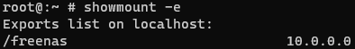
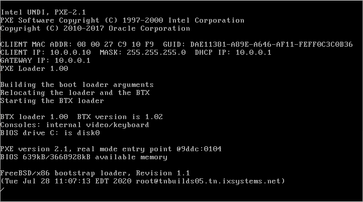
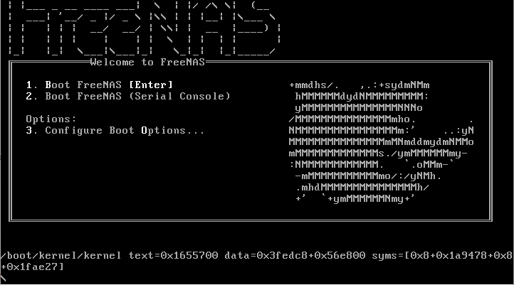
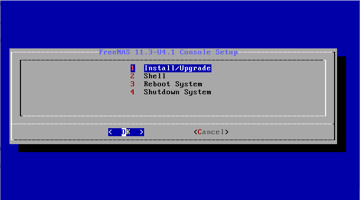

# PXE Boot FreeNAS
A step by step guide for building your own PXE boot infrastructure which can be used to boot FreeNAS.
A FreeBSD with DHCP+TFTP+NFS is configured as the PXE boot server.

# FreeNAS Image preparation
Download a FreeNAS iso image into a fresh installed FreeBSD 11.4.
```
pkg install -y wget
cd /tmp && wget http://download.freenas.org/11.3/STABLE/U4.1/x64/FreeNAS-11.3-U4.1.iso
```
Create a new directory `/freenas` and extract the iso image into `/freenas`
```
mkdir /freenas
tar -vxf /tmp/FreeNAS-11.3-U4.1.iso -C /freenas
```
Extract the included FreeNAS packages into `/freenas`
```
cd /freenas/FreeNAS/Packages
tar -vxf base-os-11.3-U4.1-25f4b91af6102a144a45003f37de92e0.tgz -C /freenas
tar -vxf freebsd-pkgdb-11.3-U4.1-25f4b91af6102a144a45003f37de92e0.tgz -C /freenas
tar -vxf freenas-pkg-tools-11.3-U4.1-25f4b91af6102a144a45003f37de92e0.tgz -C /freenas
tar -vxf FreeNASUI-11.3-U4.1-25f4b91af6102a144a45003f37de92e0.tgz -C /freenas
```
Change permission of the directory
```
chmod 775 /freenas
```
# DHCP
Install and config DHCP server
```
pkg install -y dhcpd
```
Edit `/usr/local/etc/dhcpd.conf`. 
```
default-lease-time 7200;
max-lease-time 7200;
subnet 10.0.0.0 netmask 255.255.255.0 {
  range 10.0.0.10 10.0.0.200;
  option routers 10.0.0.1;
  option root-path "10.0.0.1:/freenas";
  filename "/boot/pxeboot";
}
```
DHCP server's IP is 10.0.0.1, the addresses 10.0.0.10 to 10.0.0.200 can be allocated. The allocated IP will expire after 7200 seconds. Also, the pxe boot file is defined in this configuration. By default, the computer boots and obtains `/boot/pxeboot/`.
# TFTP
Install and config TFTP server
```
pkg install -y tftp-hpa
```
Change the TFTP root dirctory to /freenas. Edit `/etc/rc.conf`, add
```
tftpd_flags="-s /freenas"
```
Enable DHCP and TFTP service. Edit `/etc/rc.conf`, add
```
dhcpd_enable="YES"
tftpd_enable="YES"
```
Start DHCP and TFTP
```
service dhcpd start
service tftpd start
```
# NFS
Edit `/etc/exports`, add the mount point `/freenas` to the 10.0.0.0/24 network
```
/freenas -network 10.0.0.0/24 -alldirs -maproot=root
```
Enable NFS. Edit `/etc/rc.conf`, add
```
nfs_server_enable="YES"
```
Start NFS
```
service nfsd start
```
Confirmation of NFS
```
showmount -e
```

# PXE Boot
Netboot another machine from the same network, loading screenshot



Downloading FreeNAS kernel files to excute the installation



FreeNAS installer


